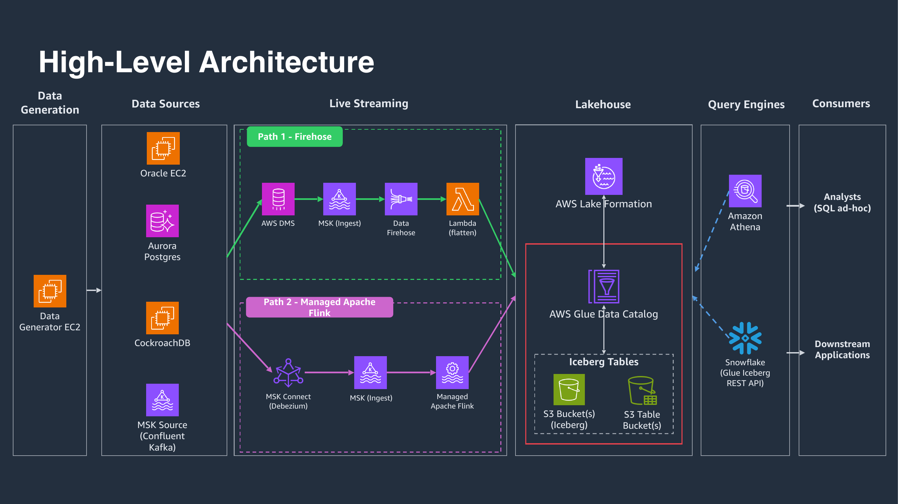

# **Iceberg Data Lakehouse** : _A comprehensive data platform for multi-source ingestion, real-time processing, and analytics using Apache Iceberg on AWS_

## Important Notice

This is sample code, for non-production usage. You should work with your security and legal teams to meet your organizational security, regulatory and compliance requirements before deployment. Deploying this sample may incur AWS charges.

> **⚠️ CockroachDB is deployed in insecure mode.** The CockroachDB cluster in
> this sample starts with `--insecure` — no TLS, no authentication, no
> authorization — and its SQL port (26257) is reachable from the entire VPC
> CIDR. Anyone with a network path into the VPC can connect as `root` with no
> credentials and read, write, or drop data. This is acceptable for a
> throwaway sample deployment only. Do not deploy this configuration to any
> environment that contains real data or is reachable from untrusted networks.
> If you need CockroachDB in production, convert it to secure mode with node
> and client certificates, TLS, authenticated users, authorization, and
> security groups scoped to specific application source SGs.

## Table of Contents

- [Important Notice](#important-notice)
- [About Iceberg Data Lakehouse](#about-iceberg-data-lakehouse)
  - [Solution Vision](#solution-vision)
  - [Solution Architecture](#solution-architecture)
  - [Key Features](#key-features)
- [Getting Started](#getting-started)
  - [Prerequisites](#prerequisites)
  - [Quick Deployment](#quick-deployment)
  - [Data Generation](#data-generation)
- [Data Lake Structure](#data-lake-structure)
- [Detailed Documentation](#detailed-documentation)
- [Security](#security)
- [License](#license)

## About Iceberg Data Lakehouse

The Iceberg Data Lakehouse project creates a modern data platform that consolidates data from multiple sources into a unified, scalable, and cost-effective solution. It enables organizations to ingest data from various sources, process it through different mechanisms, store it in Apache Iceberg format, and make it available for querying through familiar interfaces.

### Solution Vision

The platform streams data from operational databases into a unified Apache Iceberg storage layer through two parallel real-time paths — a Firehose path and a Managed Apache Flink path — giving flexibility in how change data is captured and delivered.

### Solution Architecture



The architecture consists of five main layers:

1. **Data Generation Layer**: Provides synthetic data generation for testing and demonstration
2. **Data Source Layer**: Contains various data sources (Oracle, Aurora PostgreSQL, CockroachDB, MSK)
3. **Ingestion Layer**: Captures and moves data using DMS, MSK, and Firehose
4. **Storage Layer**: Manages data storage in Apache Iceberg format on S3
5. **Query Engine Layer**: Provides interfaces for querying through Snowflake, Athena

### Key Features

- **Multi-source data integration**: Ingests data from Oracle, CockroachDB, Aurora PostgreSQL, and MSK
- **Dual ingestion paths**: Two parallel real-time streaming paths — Firehose (Path 1) and Managed Apache Flink (Path 2)
- **Flexible ingestion mechanisms**: Uses AWS DMS, Amazon Data Firehose, MSK Connect (Debezium), and Apache Flink on Amazon Managed Service for Apache Flink
- **Real-time data transformation**: Custom Lambda functions process DMS envelopes into flat transaction records
- **Apache Iceberg format**: Stores data in S3 using the Apache Iceberg table format for efficient querying and analysis
- **Schema transformation**: Automatic field name transformation and data type optimization for analytics
- **Comprehensive monitoring**: CloudWatch integration for pipeline monitoring and troubleshooting
- **Multiple query interfaces**: Makes data available through Snowflake and Amazon Athena
- **Synthetic data generation**: EC2-based Java data generator supporting all 4 sources (Oracle, Aurora, CockroachDB, MSK) with configurable throughput

## Getting Started

### Prerequisites

- AWS Account with appropriate permissions
- Terraform >= 1.8.0
- AWS CLI configured with appropriate credentials (set `AWS_PROFILE` in your shell if using a named profile)
- **(Optional)** AWS Session Manager Plugin (required for connecting to data sources)

- **(Optional — Oracle datasource only)** Oracle JDBC Driver

  The Oracle JDBC driver (`ojdbc11`) is not bundled due to its proprietary license
  (Oracle Free Use Terms and Conditions). If you plan to use the Oracle datasource,
  download the driver from
  [Oracle's JDBC Downloads page](https://www.oracle.com/database/technologies/appdev/jdbc-downloads.html)
  and place it in the data-generator classpath:

  ```bash
  cp ojdbc11-23.5.0.24.07.jar iac/roots/datasources/data-generator/generator/lib/
  ```

  ```bash
  # Install Session Manager Plugin for secure connections
  # See: https://docs.aws.amazon.com/systems-manager/latest/userguide/session-manager-working-with-install-plugin.html
  ```

### Quick Deployment

1. **Clone the repository:**

   ```bash
   git clone https://github.com/aws-samples/sample-multi-source-cdc-iceberg-lakehouse.git
   cd sample-multi-source-cdc-iceberg-lakehouse
   ```

2. **Configure your deployment environment:**

   ```bash
   cp .env.example .env
   # Edit .env and set APP_NAME, ENV_NAME, AWS_ACCOUNT_ID, and LAKE_FORMATION_ADMIN_ROLE
   ```

   The `.env` file is gitignored. Optional region/profile overrides can be set
   via shell environment variables (`AWS_PRIMARY_REGION`, `AWS_PROFILE`) before
   running any `make` target.

3. **Deploy the Terraform backend:**

   ```bash
   make deploy-tf-backend-cf-stack
   ```

4. **Deploy the complete solution (end-to-end):**

   ```bash
   # Deploy everything (both paths): foundation, datasources, MSK Ingest, Path 1, Path 2
   make deploy-infra-all
   ```

   > **⏱️ Deployment Time**: Complete deployment takes approximately **4.5–5 hours** due to MSK cluster provisioning (2 MSK clusters, ~1h40m for the ingest cluster alone). Start deployment early and keep your screen unlocked while performing other work.

   **Or deploy layer by layer (modules must be deployed in order due to dependencies):**

   ```bash
   # 1. Foundation Layer (IAM, KMS, S3, VPC, Glue DBs, Athena, S3 Tables, LF permissions)
   make deploy-foundation

   # 2. Data Sources (Oracle, CockroachDB, Aurora, MSK Source, Data Generator)
   make deploy-datasources

   # 3. MSK Ingest cluster (provisioned, 3 brokers, dual auth: SASL/SCRAM + IAM)
   make deploy-msk-ingest

   # 4. Path 1: DMS + Firehose + Lambda
   make deploy-path1

   # 5. Path 2: Debezium (MSK Connect) + Apache Flink
   make deploy-path2

   # 6. Post-deployment activation (run in this order)
   make setup-source-tables              # Create empty tables on Oracle, Aurora, CockroachDB
   make start-dms-tasks                  # DMS finds tables, activates CDC for Path 1
   make setup-cockroachdb-changefeeds    # Enable CockroachDB changefeeds
   make generate-data args="--count 1000 --wait"  # Generate test data across all sources
   ```

   **Individual firehose stream deployment (Path 1 only, if NOT using deploy-path1):**

   > **Note**: Firehose streams are included in `deploy-path1`. Only deploy individual streams if you need streaming for specific data source(s) and are NOT using the full path deployment.

   ```bash
   # Oracle CDC streams
   make deploy-ofmfs  # Oracle Financial MSK Firehose Stream
   make deploy-obmfs  # Oracle Brokerage MSK Firehose Stream

   # Aurora CDC streams
   make deploy-afmfs  # Aurora Financial MSK Firehose Stream
   make deploy-abmfs  # Aurora Brokerage MSK Firehose Stream

   # MSK direct streams
   make deploy-mffs   # MSK Financial Firehose Stream
   make deploy-mbfs   # MSK Brokerage Firehose Stream

   # CockroachDB CDC streams
   make deploy-cfmfs  # CockroachDB Financial MSK Firehose Stream
   make deploy-cbmfs  # CockroachDB Brokerage MSK Firehose Stream
   ```

   **Important deployment notes:**

   - **Deployment Order**: Modules have dependencies and must be deployed in the specified order
   - **Data Source Configuration**: If deploying only certain data sources, update `terraform.tfvars` in the data-generator module to set unused sources to `false` before deployment
   - **CockroachDB Requirement (both paths)**: Before running data generation scripts, you must SSH into CockroachDB and create changefeeds. For Path 1 (Firehose), see [CockroachDB Firehose Stream documentation](iac/roots/ingestion-layer/firehose-streams/cockroach-financial-msk-firehose-stream/README.md). For Path 2 (Flink), changefeeds must use IAM authentication to write directly to MSK Ingest topics — the Apache Flink jobs then consume from those topics

### Data Generation

After deployment, start data generation to populate your data sources:

1. **Connect to the data generator instance:**

   ```bash
   make connect-to-data-generator
   ```

   > **Note**: Requires AWS Session Manager Plugin for secure connection. See Prerequisites section above.

2. **View available data generation scripts:**

   ```bash
   ./show-available-scripts.sh
   ```

3. **Generate data for specific sources:**

   ```bash
   # MSK (Kafka) - Direct streaming
   ./msk/run-msk-financial.sh 1000    # Generate 1000 financial records
   ./msk/run-msk-brokerage.sh 500     # Generate 500 brokerage records
   ./msk/run-msk-both.sh 2000         # Generate 2000 records of both types

   # Oracle Database - CDC via DMS
   ./oracle/run-oracle-financial.sh 1000
   ./oracle/run-oracle-brokerage.sh 500
   ./oracle/run-oracle-both.sh 1500

   # Aurora PostgreSQL - CDC via DMS
   ./aurora/run-aurora-financial.sh 1000
   ./aurora/run-aurora-brokerage.sh 500
   ./aurora/run-aurora-both.sh 1500

   # CockroachDB - CDC via Changefeed
   ##### IMPORTANT #####
   # Before running CockroachDB data generation scripts, you must SSH into CockroachDB and enable changefeeds.
   # See CockroachDB Financial/Brokerage Firehose Stream documentation for changefeed setup instructions.
   # Without this step, no CockroachDB data ingestion will  occur.
   ##### IMPORTANT #####
   ./cockroach/run-cockroach-financial.sh 1000
   ./cockroach/run-cockroach-brokerage.sh 500
   ./cockroach/run-cockroach-both.sh 1500
## Data Lake Structure

After deployment, your Iceberg data lake will have the following structure:

### Path 1 (Firehose) — Glue Catalog Databases (4 databases)

Located in AWS Glue Data Catalog, prefix `f_`:

1. **`{APP}_{ENV}_f_oracle`** - Oracle CDC data via DMS + Firehose
2. **`{APP}_{ENV}_f_aurora`** - Aurora PostgreSQL data via DMS + Firehose
3. **`{APP}_{ENV}_f_crdb`** - CockroachDB CDC data via Firehose
4. **`{APP}_{ENV}_f_msk_src`** - Direct MSK streaming data via Firehose

### Path 2 (Flink) — Glue Catalog Databases (4 databases)

Located in AWS Glue Data Catalog, prefix `c_`:

1. **`{APP}_{ENV}_c_oracle`** - Oracle CDC data via Debezium + Apache Flink
2. **`{APP}_{ENV}_c_aurora`** - Aurora PostgreSQL CDC via Debezium + Apache Flink
3. **`{APP}_{ENV}_c_crdb`** - CockroachDB CDC via Changefeed + Apache Flink
4. **`{APP}_{ENV}_c_msk_src`** - Direct MSK streaming via Apache Flink

### S3 Tables (8 namespaces, 16 tables)

S3 Tables provides managed Iceberg tables with automatic compaction. Queryable via Athena using the child catalog `"s3tablescatalog/<bucket-name>"` (e.g., `SELECT * FROM "s3tablescatalog/{APP}-{ENV}-iceberg-table-bucket"."<namespace>"."<table>"`):

- **`{APP}_{ENV}_f_oracle`**: `fin`, `brk` (Path 1 Firehose)
- **`{APP}_{ENV}_f_aurora`**: `fin`, `brk` (Path 1 Firehose)
- **`{APP}_{ENV}_f_crdb`**: `fin`, `brk` (Path 1 Firehose)
- **`{APP}_{ENV}_f_msk_src`**: `fin`, `brk` (Path 1 Firehose)
- **`{APP}_{ENV}_c_oracle`**: `fin`, `brk` (Path 2 Connect)
- **`{APP}_{ENV}_c_aurora`**: `fin`, `brk` (Path 2 Connect)
- **`{APP}_{ENV}_c_crdb`**: `fin`, `brk` (Path 2 Connect)
- **`{APP}_{ENV}_c_msk_src`**: `fin`, `brk` (Path 2 Connect)

### Tables per Database

Each Firehose database contains two tables: **`fin`** (financial transactions) and **`brk`** (brokerage transactions).

Each Connect database contains pre-created tables: **`fin`** and **`brk`** (created by Terraform with typed schemas).

### S3 Iceberg Data Lake

Data is stored under `s3://{APP}-{ENV}-iceberg-datalake-primary/` with Iceberg table directories organized by database and table name. Each table directory contains `data/` (Parquet files), `metadata/` (Iceberg metadata), and `errors/` (Firehose processing errors, Path 1 only).

### Data Ingestion Patterns

**Path 1 (DMS + Firehose + Lambda):**
- **CDC (Oracle/Aurora)**: DB → DMS → MSK Ingest (SASL/SCRAM) → Firehose → Lambda (flatten DMS envelope) → S3 Iceberg
- **Changefeed (CockroachDB)**: DB → MSK Ingest → Firehose → Lambda (flatten) → S3 Iceberg
- **Direct Streaming (MSK)**: Generator → MSK Source → Firehose (no transform) → S3 Iceberg

**Path 2 (Debezium on MSK Connect + Apache Flink):**
- **CDC (Oracle)**: Oracle → MSK Connect (Debezium Oracle LogMiner) → MSK Ingest (IAM) → Apache Flink (`OracleCdcJob`) → S3 Iceberg + S3 Tables
- **CDC (Aurora)**: Aurora → MSK Connect (Debezium PostgreSQL pgoutput) → MSK Ingest (IAM) → Apache Flink (`AuroraCdcJob`) → S3 Iceberg + S3 Tables
- **Changefeed (CockroachDB)**: DB → MSK Ingest (IAM) → Apache Flink (`CockroachCdcJob`) → S3 Iceberg + S3 Tables
- **Direct Streaming (MSK)**: Generator → MSK Source → Apache Flink (`MskAppendJob`) → S3 Iceberg + S3 Tables

### Query Access Points

- **Amazon Athena**: Query all databases and tables via SQL
- **Snowflake**: External data warehouse integration (see [Snowflake Integration Guide](snowflake-integration/integration.md))

### Destroy Resources

```bash
# Destroy everything (reverse dependency order)
make destroy-infra-all

# Or destroy the Terraform backend
make destroy-tf-backend-cf-stack
```

> **⏱️ Deletion Time**: Complete deletion takes approximately **2-3 hours** due to MSK cluster deletion (2 MSK clusters) and removal of data files from S3 Iceberg Data Lake. Start deletion early and keep your screen unlocked while performing other work.

## Detailed Documentation

### Architecture Diagrams

- **[High-Level Architecture](diagrams/high-level-architecture.png)**: Complete system overview (both ingestion paths)
- **[Path 1 — Firehose](diagrams/path1-firehose.png)**: DMS/changefeed → MSK → Firehose → Lambda → Iceberg
- **[Path 2 — Managed Apache Flink](diagrams/path2-managed-flink.png)**: Debezium source / changefeed → MSK → Flink → Iceberg
- **[Data Ingestion Flows](diagrams/data-ingestion-flows.md)**: Detailed per-source streaming flow diagrams
- **[Snowflake Querying](diagrams/snowflake-querying.png)**: Querying Iceberg tables from Snowflake via the Glue Iceberg REST API

### Layer-Specific Documentation

- **[Foundation Layer](iac/roots/foundation/README.md)**: Core infrastructure (KMS, IAM, network, S3, Glue databases, Athena, S3 Tables)
- **[Data Sources Layer](iac/roots/datasources/README.md)**: Oracle, Aurora, CockroachDB, and MSK Source configuration
- **[Ingestion Layer](iac/roots/ingestion-layer/README.md)**: Path 1 (DMS, Firehose) and Path 2 (Debezium on MSK Connect, MSK Ingest)
- **[Firehose Streams](iac/roots/ingestion-layer/firehose-streams/README.md)**: Path 1 real-time streaming configuration for the 8 source × table combinations
- **[Apache Flink Applications](iac/roots/flink/README.md)**: Path 2 Managed Flink applications that consume from MSK and write to Iceberg

### Implementation Guides

- **[Data Generator](iac/roots/datasources/data-generator/README.md)**: Synthetic data generation and schema details
- **[Snowflake Integration](snowflake-integration/integration.md)**: Querying Iceberg tables from an external Snowflake account

## Security

For the sample's security posture, accepted Checkov suppressions, and
the full Path to Production checklist, see [SECURITY.md](SECURITY.md).

To report a vulnerability, see
[CONTRIBUTING.md#security-issue-notifications](CONTRIBUTING.md#security-issue-notifications).

## License

This library is licensed under the MIT-0 License. See the [LICENSE](LICENSE) file.
