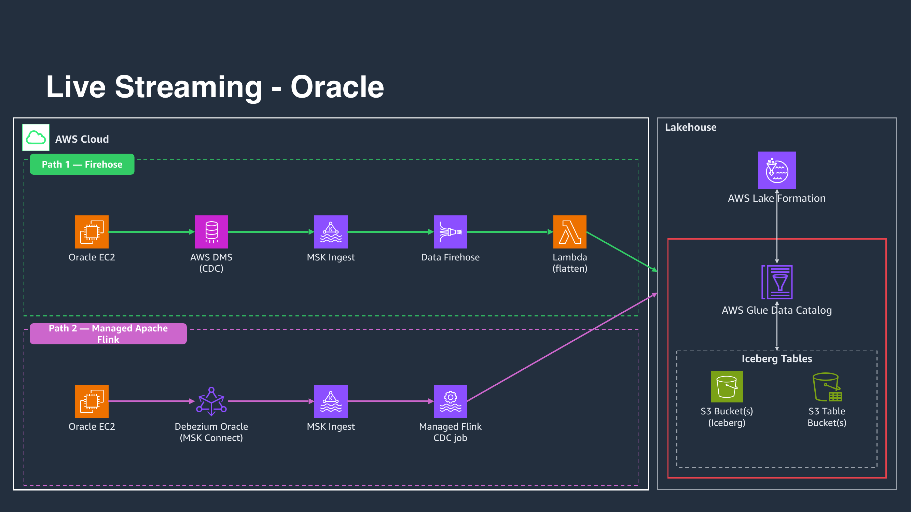
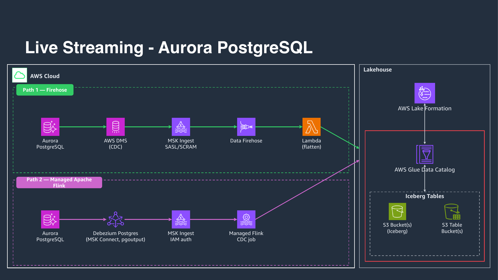
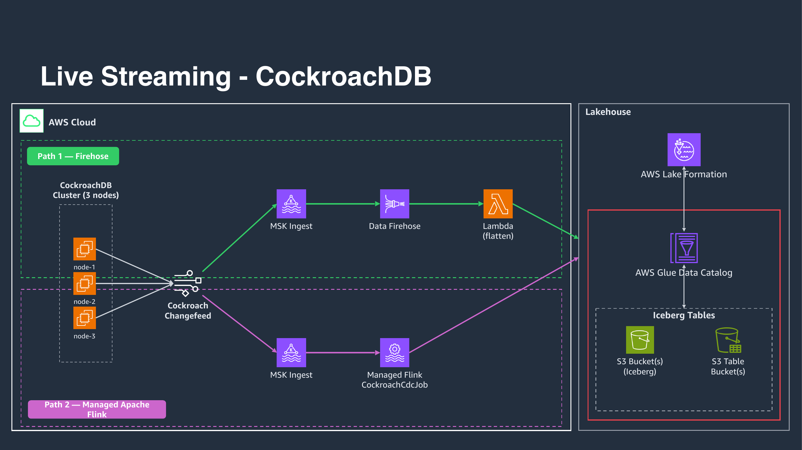
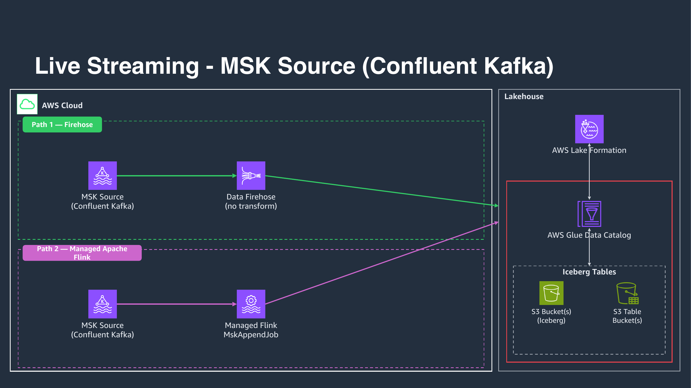

# Data Ingestion Flows

This document provides detailed diagrams for the different data ingestion flows in the Iceberg Data Lakehouse architecture.

## Architecture Overview

The Iceberg Data Lakehouse ingests the same source data through **two parallel streaming paths**:

1. **Path 1 - Firehose**: source → MSK → Kinesis Data Firehose → Lambda transform → Iceberg (`f_*` tables)
2. **Path 2 - Apache Flink**: source → MSK (Debezium source connector for Oracle/Aurora; native changefeed/direct for CockroachDB/MSK) → Managed Apache Flink → Iceberg (`c_*` tables)

Everything is streaming - there is no batch path. The diagrams below detail the **Path 1 (Firehose)** flow per source; Path 2 consumes the same MSK topics with a dedicated Flink application per source.

## Real-time Streaming Ingestion Flows

### Oracle CDC Streaming



**Flow**: Oracle Database → DMS CDC → MSK → Firehose → Lambda Transformer → S3 Iceberg

- **AWS DMS**: Captures change data from Oracle database
- **MSK Integration**: Streams CDC events to dedicated MSK topics
- **Lambda Transformation**: Flattens DMS CDC envelopes into transaction records
- **Firehose Streams**: 2 streams (financial + brokerage) with transformation enabled

**Key Features:**
- Real-time transaction capture with CDC
- DMS envelope flattening via Lambda (Python 3.11)
- Automatic schema transformation (UPPERCASE → lowercase)
- Dual transaction type support (financial/brokerage)

### Aurora CDC Streaming



**Flow**: Aurora PostgreSQL → DMS CDC → MSK → Firehose → Lambda Transformer → S3 Iceberg

- **AWS DMS**: PostgreSQL-compatible CDC capture
- **MSK Integration**: Dedicated topics for Aurora CDC events
- **Lambda Transformation**: DMS envelope processing for flat records
- **Firehose Streams**: 2 streams (financial + brokerage) with transformation enabled

**Key Features:**
- PostgreSQL compatibility with enhanced monitoring
- Multi-AZ deployment for high availability
- Lambda-based DMS envelope flattening

### CockroachDB CDC Streaming



**Flow**: CockroachDB → Changefeed → MSK → Firehose → Lambda Transformer → S3 Iceberg

- **CockroachDB Changefeed**: Native CDC capability (requires manual enablement)
- **MSK Integration**: Direct streaming to MSK topics
- **Lambda Transformation**: Processes changefeed events into transaction records
- **Firehose Streams**: 2 streams (financial + brokerage) with transformation enabled

**Key Features:**
- Distributed SQL with horizontal scalability
- Manual changefeed setup required before data generation
- Strong consistency guarantees
- Cloud-native distributed architecture

### MSK Direct Streaming



**Flow**: EC2 Data Generator → MSK Source → Firehose → S3 Iceberg (No Transformation)

- **EC2 Java Data Generator**: Synthetic transaction data generation (all 4 sources)
- **Direct MSK Publishing**: No intermediate CDC layer
- **Firehose Streams**: 2 streams (financial + brokerage) with transformation disabled
- **Native Format**: Data already in flat transaction format

**Key Features:**
- Configurable-throughput synthetic data generation
- No Lambda transformation needed (data pre-flattened)
- Direct streaming without CDC overhead

## Firehose Stream Architecture

### 8 Firehose Stream Combinations

The architecture deploys 8 distinct firehose streams covering all data source and transaction type combinations:

#### CDC Sources (with Lambda Transformation)
1. **Oracle Financial MSK Firehose Stream** (`deploy-ofmfs`)
2. **Oracle Brokerage MSK Firehose Stream** (`deploy-obmfs`)
3. **Aurora Financial MSK Firehose Stream** (`deploy-afmfs`)
4. **Aurora Brokerage MSK Firehose Stream** (`deploy-abmfs`)
5. **CockroachDB Financial MSK Firehose Stream** (`deploy-cfmfs`)
6. **CockroachDB Brokerage MSK Firehose Stream** (`deploy-cbmfs`)

#### Direct Sources (no Lambda Transformation)
7. **MSK Financial Firehose Stream** (`deploy-mffs`)
8. **MSK Brokerage Firehose Stream** (`deploy-mbfs`)

### Lambda Transformation Logic

**CDC Sources**: Lambda functions flatten DMS CDC envelopes:
- Extract transaction data from DMS envelope structure
- Convert field names from UPPERCASE to lowercase
- Transform data types for analytics compatibility
- Handle schema evolution automatically

**Direct Sources**: No transformation needed:
- Data already in flat transaction format from the EC2 Java data generator
- Direct passthrough to Iceberg format
- Optimized for performance with minimal processing

## Data Lake Integration

### Glue Catalog Structure
- **8 Databases**: 4 Path 1 (`{app}_{env}_f_{oracle,aurora,crdb,msk_src}`) + 4 Path 2 (`{app}_{env}_c_{oracle,aurora,crdb,msk_src}`)
- **16 Tables**: 2 per database (`fin`, `brk`)
- **Unified Schema**: Consistent column structure across all sources

### S3 Iceberg Storage
- **16 Tables**: each with `data/`, `metadata/` (and `errors/` for Path 1 Firehose streams)
- **Apache Iceberg Format**: ACID transactions and schema evolution
- **Error Handling**: Firehose processing errors captured in `errors/` folders (Path 1 only)

### Query Engine Access
- **Amazon Athena**: SQL queries across all databases and tables
- **Snowflake**: External data warehouse integration (see `snowflake-integration/`)

## Deployment Patterns

### Layer-by-Layer Deployment
```bash
make deploy-foundation      # IAM, networking, KMS, S3, Glue DBs, Athena, S3 Tables
make deploy-datasources     # Oracle, Aurora, CockroachDB, MSK Source, data generator
make deploy-msk-ingest      # MSK Ingest cluster
make deploy-path1           # DMS + all 8 firehose streams (Path 1)
make deploy-path2           # Debezium sources + Managed Apache Flink apps (Path 2)
make start-dms-tasks        # Activate CDC data flow
```

### Individual Stream Deployment
Only needed for granular control when NOT using `deploy-path1`:
```bash
make deploy-ofmfs  # Oracle Financial
make deploy-obmfs  # Oracle Brokerage
# ... etc for all 8 streams
```

## Architecture Benefits

### Dual Streaming Paths
- **Path 1 (Firehose)**: buffer-based delivery with Lambda transformation
- **Path 2 (Apache Flink)**: commit-based streaming with per-source Flink applications

### Flexible Transformation
- **CDC Sources**: Lambda transformation for envelope flattening (Path 1)
- **Direct Sources**: No transformation overhead for pre-formatted data

### Comprehensive Coverage
- **8 Stream Combinations**: All data source and transaction type permutations (per path)
- **Unified Storage**: Single Iceberg data lake with consistent schema
- **Multiple Access**: Query through Athena or Snowflake

### Operational Excellence
- **Error Handling**: Dedicated error folders for troubleshooting
- **Monitoring**: CloudWatch integration across all streams
- **Scalability**: Serverless components auto-scale with demand

For detailed implementation guides, see the [Firehose Streams Documentation](../iac/roots/ingestion-layer/firehose-streams/README.md).
